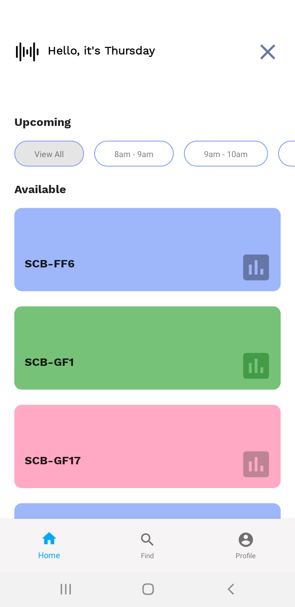
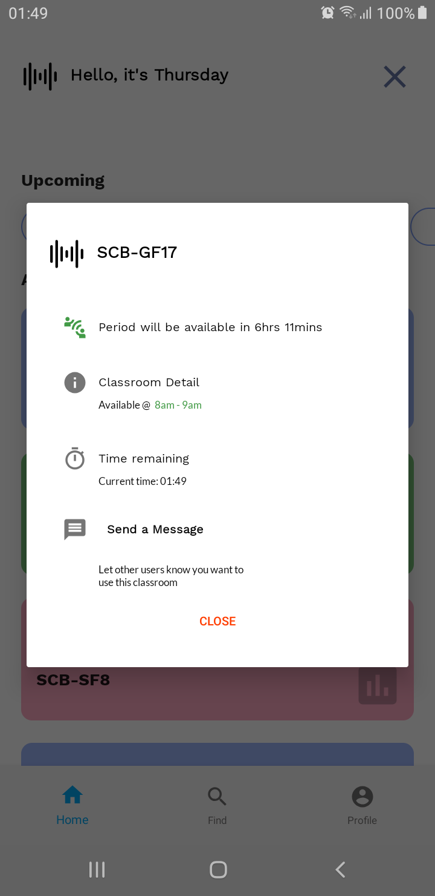
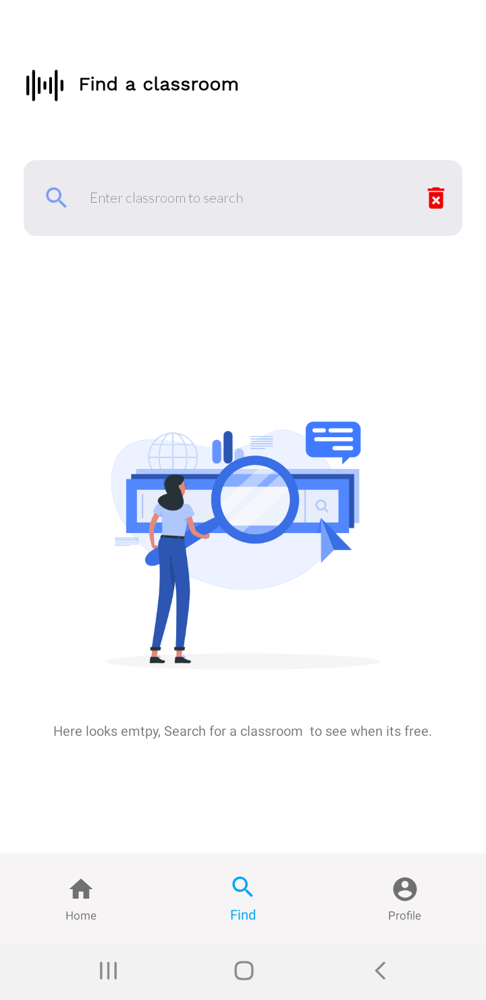

# Open Classrooms

Class rescheduling assistant

## How it works

Open Classrooms is an android mobile app for helping students and specifically class leads or representatives 

to find free or empty classrooms when classes get rescheduled. 

The app works by collecting the timetable data of all the interested course programs. The app backend structure of the 

timetable uses NoSql Firestore documents, this helps to easily filter or find empty classrooms.

The app idea was to solve issues that arise when class leads have to search for empty classrooms 
 
when classes get rescheduled in my university.

## Screenshots

### Home Screen

### Classroom Detail Dialog

### Search Screen

